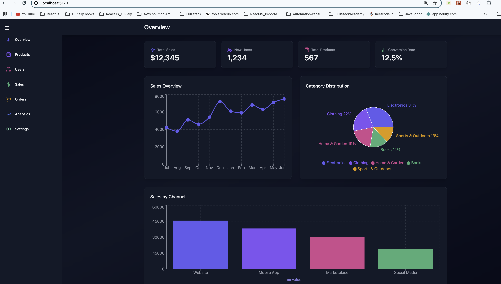
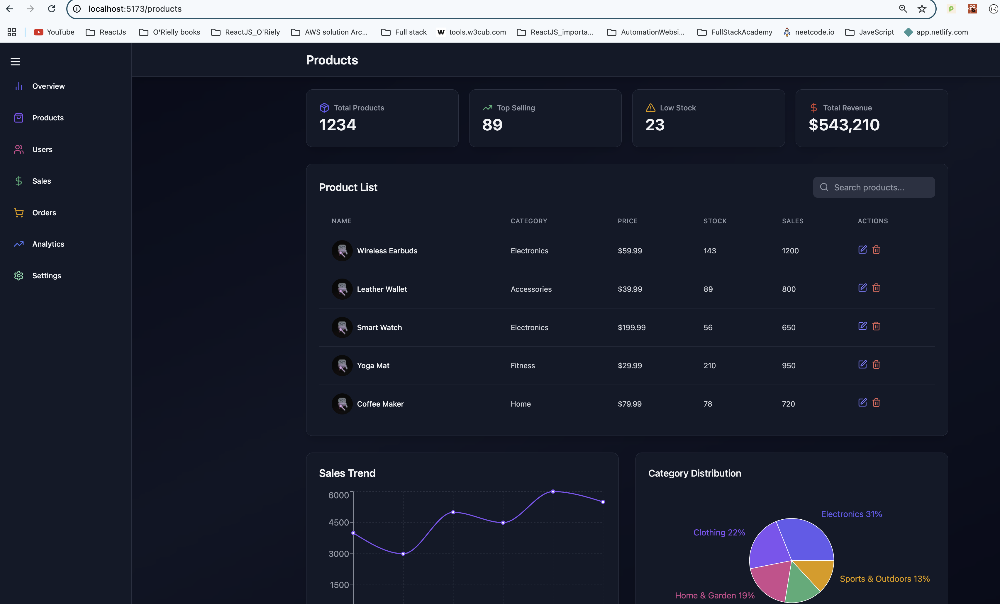
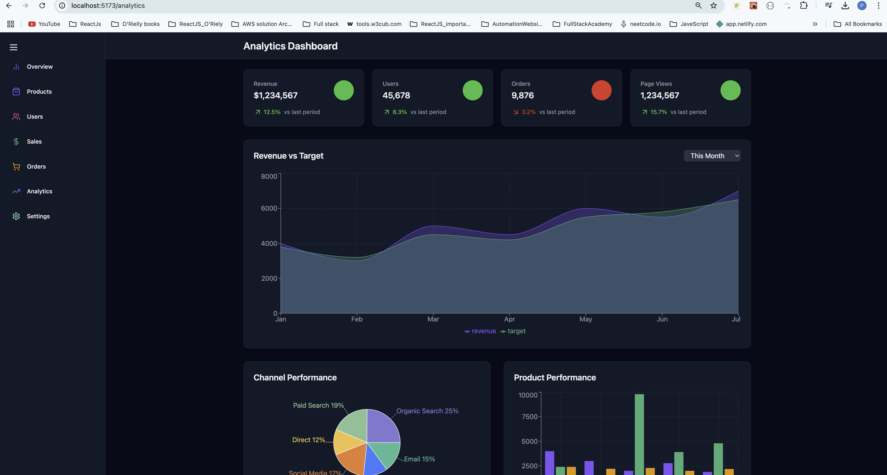
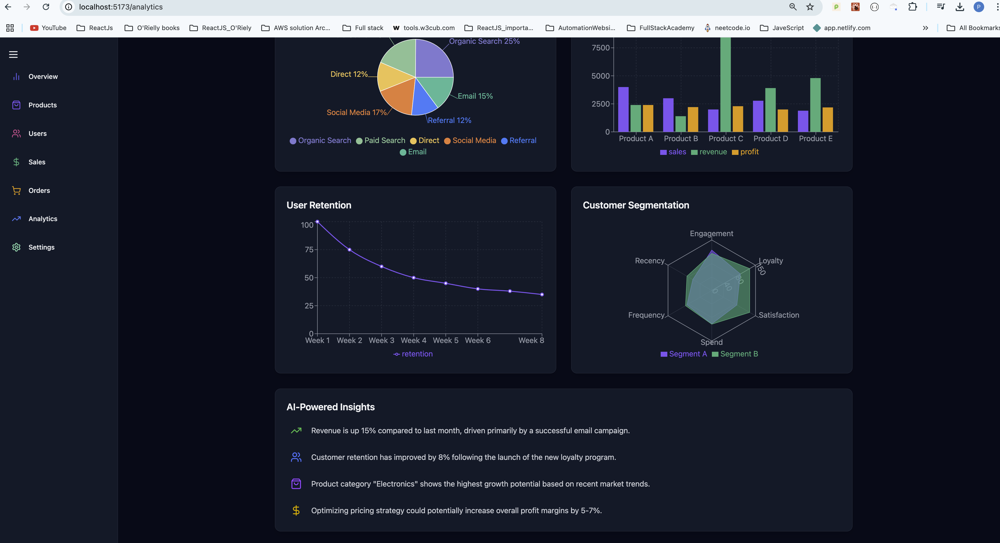
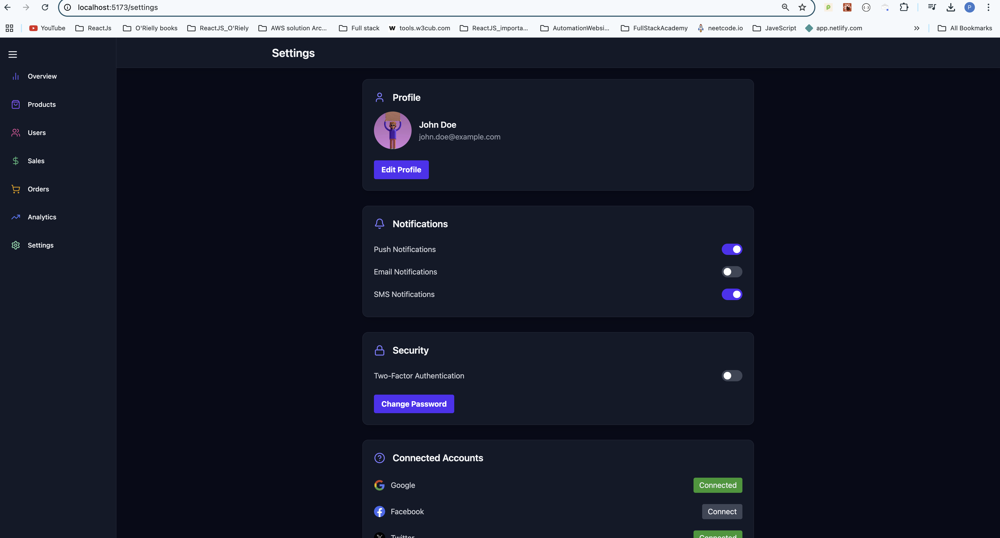
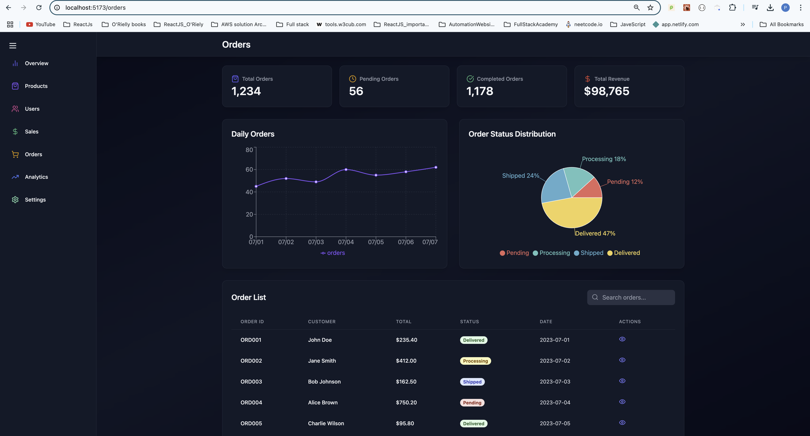
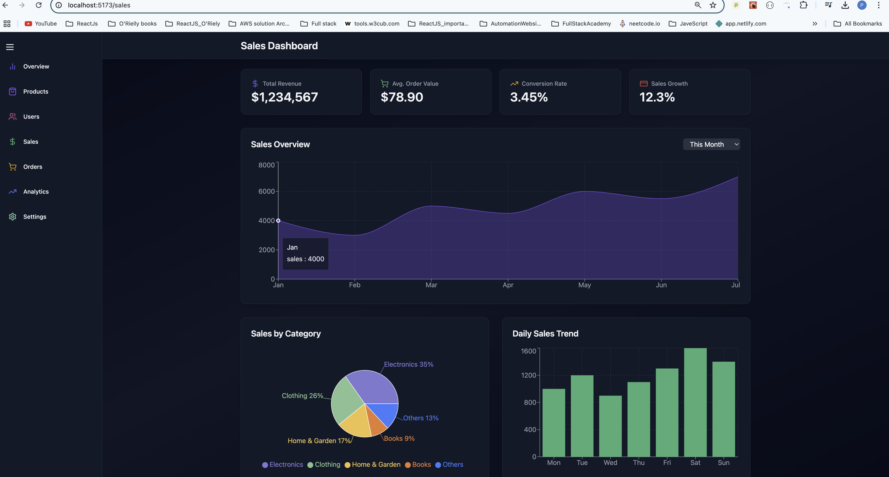
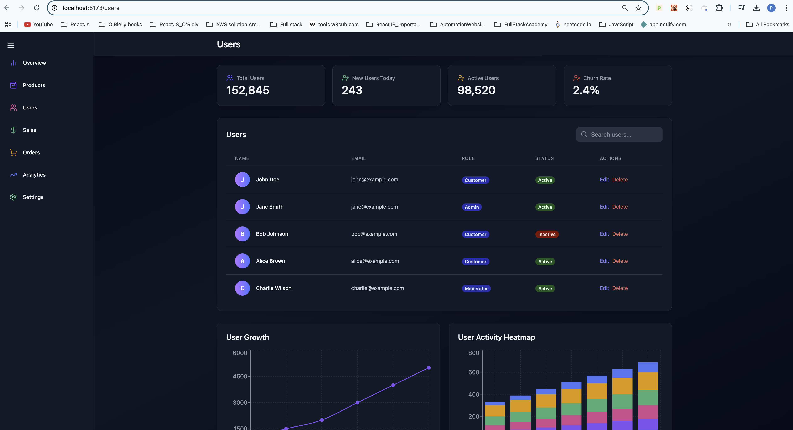
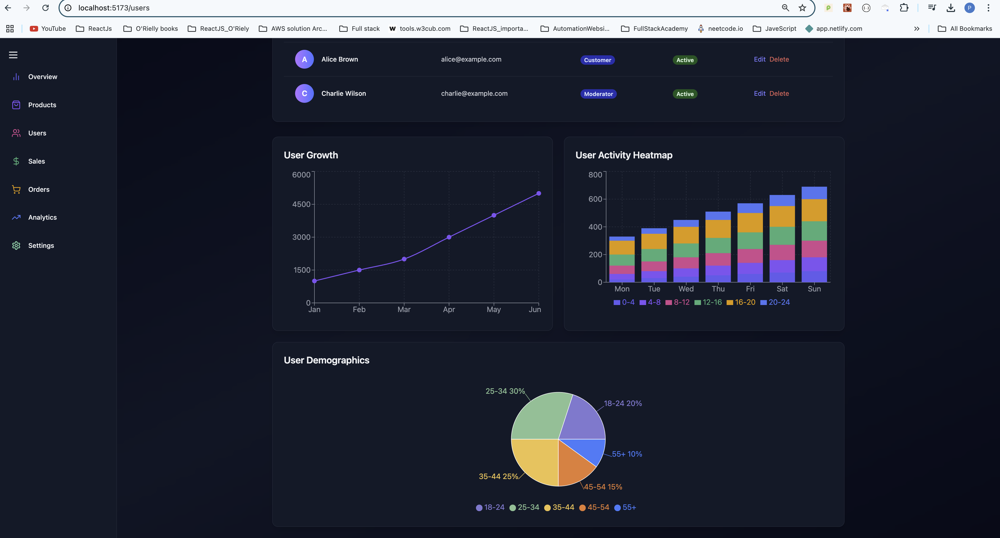

# Admin Dashboard App
* React 3D Pie Chart with Recharts & Framer Motion

# 📊 React 3D Pie Chart with Recharts & Framer Motion

### 🚀 A visually appealing **3D Pie Chart** using `Recharts`, `Framer Motion`, and `Tailwind CSS`.  
It provides a **smooth animation** and a **gradient-based depth effect** for a **realistic 3D feel**.

---

## 📸 Screenshot

---

## **📌 Features**
✔ **3D-like Pie Chart Effect** using **Gradients & Layering**  
✔ **Smooth Animations** using **Framer Motion**  
✔ **Fully Responsive** with `ResponsiveContainer`  
✔ **Interactive Tooltips & Legends**  
✔ **Dynamic Color Gradients for Realistic 3D Depth**  
✔ **Tailwind CSS Styling** for a sleek UI  

---

## **💻 Technologies Used**
| **Technology**  | **Usage**  |
|--------------|------------|
| **React.js** | Frontend Framework |
| **Recharts** | Data Visualization |
| **Framer Motion** | Smooth Animations |
| **Tailwind CSS** | UI Styling |
| **Vite** | Fast Development Server |

---

